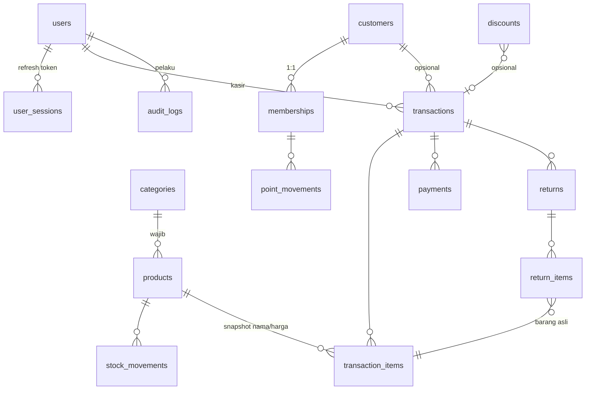

# Desain Skema Database — db_pos (PostgreSQL 16+)

> **Proyek:** FakhriPOS — POS App (Bun + Elysia + Drizzle ORM, Next.js + shadcn/ui)
> **Database:** `db_pos` — PostgreSQL 16+
> **Versi dokumen:** 2.0 (diselaraskan dengan `features.md` & `user-stories.md` BA)
> **Status:** final untuk implementasi backend phase berikutnya

---

## 1. Ringkasan & Keputusan Desain

| Keputusan | Pilihan | Alasan |
|---|---|---|
| Jumlah tabel | **17 tabel** (+ 12 tipe enum, 1 fungsi trigger) | Cover semua modul baseline: auth, produk, transaksi, pembayaran, pelanggan/member/poin, diskon/pajak, return, audit, laporan, dashboard |
| Format uang | **BIGINT = integer rupiah utuh** (IDR) — `Rp 15.000 = 15000` | Keputusan BA §4: IDR tidak punya pecahan sen. Menerapkan pola "integer cents" (anti floating point) dengan unit rupiah. Jangan pernah `FLOAT`/`NUMERIC` untuk uang (BA §9) |
| Jumlah barang | **NUMERIC(12,3)** — 9 digit + 3 desimal | Dukung unit non-integer (kg, liter) tanpa floating point error |
| Timestamp | **TIMESTAMPTZ** selalu (UTC), `DEFAULT now()` | BA §4.11 — laporan dikelompokkan per hari pakai `AT TIME ZONE 'Asia/Jakarta'` |
| ID | **UUID** `DEFAULT gen_random_uuid()` untuk semua tabel (BA §9) | `gen_random_uuid()` bawaan PG13+. Nomor transaksi/return terpisah (format harian) untuk tampilan |
| Stok | **Ledger (`stock_movements`) = sumber kebenaran** + kolom denormalisasi `products.stock_on_hand` untuk baca cepat | POS butuh cek stok saat scan barcode; ledger tetap jadi jejak audit. Keduanya di-update dalam 1 transaksi DB |
| Soft delete | `deleted_at TIMESTAMPTZ` di `users`, `products`, `categories`, `customers` | Riwayat transaksi tidak boleh putus (BA §9). Unique index *partial* (`WHERE deleted_at IS NULL`) |
| Enum vs varchar | **Native `CREATE TYPE ... AS ENUM`** untuk set nilai kecil & stabil (role, status, method). `VARCHAR` + nilai bebas untuk set terbuka (`audit_logs.action`, `entity_type`) | Lihat catatan §8.1 |
| Nomor transaksi | `TRX-YYYYMMDD-XXXX` & `RET-YYYYMMDD-XXXX` dibentuk aplikasi (counter harian per outlet) | BA §4.10 & RET-05; unik dijamin unique index + retry, lihat §8.6 |
| Multi-outlet | `outlet_id BIGINT NOT NULL DEFAULT 1` di tabel operasional | BA §4.1/§8 — struktur siap multi-outlet P1 tanpa migrasi besar; tabel `outlets` dibuat saat P1 |
| Kategori | 1 level, **wajib** per produk (BA PROD-02) | Subkategori = ekstensi P2 |

### Diagram relasi (ringkas)



---

## 2. Konvensi Kolom Global

1. **Uang = BIGINT integer rupiah.** Konversi di aplikasi: nilai langsung = rupiah (tidak ada pembagian). Tidak pernah pakai `FLOAT`/`DOUBLE`/`NUMERIC` untuk uang. Aman di JS `Number` (max 9e15 ≫ kebutuhan toko).
2. **Timestamp = TIMESTAMPTZ** (UTC), default `now()`. Kolom `created_at`, `updated_at` ada di hampir semua tabel; `updated_at` di-maintain trigger `set_updated_at()`.
3. **Jumlah (quantity) = NUMERIC(12,3)**, selalu `CHECK (quantity > 0)`.
4. **Soft delete**: `deleted_at TIMESTAMPTZ NULL`. Query aplikasi wajib filter `deleted_at IS NULL` (Drizzle: `isNull(t.deletedAt)`). Unique index partial menegakkan keunikan hanya pada baris aktif.
5. **ID = UUID** (`DEFAULT gen_random_uuid()`), semua FK `UUID`. Nomor tampilan (TRX-/RET-) terpisah dan dibentuk aplikasi.
6. **Snapshot** untuk data historis: `transaction_items.product_name/product_sku/unit_price/cost_price`, `transactions.discount_name`, `return_items.product_name/unit_price` — laporan laba & struk tidak berubah walau produk diedit/dihapus.
7. **Enum** didefinisikan sekali via `CREATE TYPE` (lihat DDL §6).
8. Naming: tabel jamak snake_case; FK `*_id`; boolean `is_*`; enum tipe `*_type`/`*_status`/`*_method`.

---

## 3. Daftar Tabel

| # | Tabel | Modul | Keterangan |
|---|---|---|---|
| 1 | `users` | Auth (M1) | Admin / manager / kasir |
| 2 | `user_sessions` | Auth (M1) | Refresh token (hash) + revoke |
| 3 | `categories` | Produk (M2) | Kategori 1 level; produk wajib berkategori |
| 4 | `products` | Produk (M2) | SKU, barcode, harga beli/jual (rupiah), stok denormalisasi, `min_stock` |
| 5 | `stock_movements` | Stok (M2) | Ledger semua mutasi stok (sumber kebenaran) |
| 6 | `customers` | Pelanggan (M5) | Data pelanggan non-member & member |
| 7 | `memberships` | Member/poin (M5) | 1:1 dengan customer; tier & saldo poin |
| 8 | `point_movements` | Member/poin (M5) | Riwayat mutasi poin (earned/redeemed/adjustment) |
| 9 | `discounts` | Diskon (M6) | Diskon global/kategori/produk, % atau nominal, periode aktif, kuota (promo = P2) |
| 10 | `tax_rates` | Pajak (M6) | PPN dsb.; `is_inclusive` untuk harga sudah termasuk pajak |
| 11 | `transactions` | Transaksi (M3) | Header penjualan (struk), status, ringkasan nilai |
| 12 | `transaction_items` | Transaksi (M3) | Baris item (snapshot harga/cost), `returned_quantity` |
| 13 | `payments` | Pembayaran (M4) | Cash/QRIS/transfer; tipe sale & refund (cashflow lengkap) |
| 14 | `returns` | Return (M10, P1) | Header return/refund |
| 15 | `return_items` | Return (M10, P1) | Baris return, FK ke `transaction_items` asli |
| 16 | `audit_logs` | Audit (M11, P1) | Log semua aksi penting (JSONB old/new), append-only |
| 17 | `settings` | Konfigurasi (M9) | Key-value JSONB: profil toko, aturan poin, threshold, dll. |

**Enum (12):** `user_role`, `membership_tier`, `movement_type`, `transaction_status`, `payment_status`, `payment_method`, `payment_type`, `discount_type`, `discount_scope`, `refund_method`, `return_status`, `point_movement_type`.

---

## 4. Detail Tabel

> Format: **Kolom | Tipe | Constraint | Keterangan**. Semua `id` = `UUID PRIMARY KEY DEFAULT gen_random_uuid()` (tidak diulang di keterangan).

### 4.1 `users`

| Kolom | Tipe | Constraint | Keterangan |
|---|---|---|---|
| id | UUID | PK | |
| name | VARCHAR(100) | NOT NULL | |
| email | VARCHAR(255) | NOT NULL | Unique partial (aktif) |
| phone | VARCHAR(30) | NULL | |
| password_hash | TEXT | NOT NULL | Argon2id/bcrypt |
| role | user_role | NOT NULL DEFAULT 'kasir' | admin / manager / kasir |
| outlet_id | BIGINT | NOT NULL DEFAULT 1 | Multi-outlet P1 |
| is_active | BOOLEAN | NOT NULL DEFAULT TRUE | Nonaktif = tidak bisa login |
| last_login_at | TIMESTAMPTZ | NULL | |
| created_at / updated_at / deleted_at | TIMESTAMPTZ | s.d. konvensi | |

Index: `uq_users_email_active ON (email) WHERE deleted_at IS NULL` (unique partial).

### 4.2 `user_sessions`

| Kolom | Tipe | Constraint | Keterangan |
|---|---|---|---|
| id | UUID | PK | |
| user_id | UUID | NOT NULL, FK → users.id, ON DELETE CASCADE | |
| refresh_token_hash | TEXT | NOT NULL | Hash token refresh (jangan simpan plaintext) |
| user_agent | TEXT | NULL | |
| ip_address | INET | NULL | |
| expires_at | TIMESTAMPTZ | NOT NULL | Default 7 hari |
| revoked_at | TIMESTAMPTZ | NULL | Logout / rotasi |
| created_at | TIMESTAMPTZ | NOT NULL DEFAULT now() | |

Index: `(user_id)`, `(expires_at)`.

### 4.3 `categories`

| Kolom | Tipe | Constraint | Keterangan |
|---|---|---|---|
| id | UUID | PK | |
| name | VARCHAR(100) | NOT NULL | |
| slug | VARCHAR(120) | NOT NULL | Unique partial (aktif) |
| description | TEXT | NULL | |
| sort_order | INT | NOT NULL DEFAULT 0 | Urutan tampil |
| is_active | BOOLEAN | NOT NULL DEFAULT TRUE | |
| created_at / updated_at / deleted_at | TIMESTAMPTZ | s.d. konvensi | |

Index: `uq_categories_slug_active ON (slug) WHERE deleted_at IS NULL`. 1 level saja (BA PROD-02); subkategori = P2.

### 4.4 `products`

| Kolom | Tipe | Constraint | Keterangan |
|---|---|---|---|
| id | UUID | PK | |
| category_id | UUID | NOT NULL, FK → categories.id | Wajib (BA PROD-02); soft-delete kategori tidak memutus relasi |
| name | VARCHAR(200) | NOT NULL | |
| sku | VARCHAR(50) | NULL | Opsional (BA PROD-01); unique partial |
| barcode | VARCHAR(100) | NULL | Opsional; unique partial |
| description | TEXT | NULL | |
| unit | VARCHAR(20) | NOT NULL DEFAULT 'pcs' | pcs / pack / box / kg / gram / liter / meter (BA PROD-03) |
| cost_price | BIGINT | NOT NULL DEFAULT 0, CHECK ≥ 0 | Harga beli, **rupiah** |
| selling_price | BIGINT | NOT NULL DEFAULT 0, CHECK ≥ 0 | Harga jual, **rupiah** |
| stock_on_hand | NUMERIC(12,3) | NOT NULL DEFAULT 0, CHECK ≥ 0 | **Denormalisasi** — dirawat bersama `stock_movements` |
| min_stock | NUMERIC(12,3) | NOT NULL DEFAULT 0 | Threshold stok menipis; default dari settings (BA PROD-09) |
| outlet_id | BIGINT | NOT NULL DEFAULT 1 | Stok/harga per outlet P1 |
| is_active | BOOLEAN | NOT NULL DEFAULT TRUE | Nonaktif tidak muncul di kasir, tetap di riwayat (BA PROD-08) |
| is_taxable | BOOLEAN | NOT NULL DEFAULT TRUE | Pajak per produk (BA DISC-06, diimplementasikan lebih awal) |
| created_at / updated_at / deleted_at | TIMESTAMPTZ | s.d. konvensi | |

Index:
- `uq_products_sku_active ON (sku) WHERE deleted_at IS NULL AND sku IS NOT NULL` (unique partial)
- `uq_products_barcode_active ON (barcode) WHERE deleted_at IS NULL AND barcode IS NOT NULL` (unique partial)
- `(category_id)`
- `GIN (name gin_trgm_ops)` — pencarian nama produk (pg_trgm)
- **Partial low-stock:** `(min_stock) WHERE deleted_at IS NULL AND is_active AND stock_on_hand <= min_stock`

### 4.5 `stock_movements` (ledger stok)

| Kolom | Tipe | Constraint | Keterangan |
|---|---|---|---|
| id | UUID | PK | |
| product_id | UUID | NOT NULL, FK → products.id | |
| type | movement_type | NOT NULL | initial / purchase_in / sale_out / return_in / adjustment / cancellation |
| quantity | NUMERIC(12,3) | NOT NULL, CHECK > 0 | Selalu positif; arah ditentukan `type` |
| before_qty | NUMERIC(12,3) | NOT NULL | Stok sebelum mutasi |
| after_qty | NUMERIC(12,3) | NOT NULL | Stok sesudah mutasi |
| transaction_id | UUID | NULL, FK → transactions.id, ON DELETE SET NULL | Isi saat sale_out / cancellation |
| return_id | UUID | NULL, FK → returns.id, ON DELETE SET NULL | Isi saat return_in |
| reference | VARCHAR(100) | NULL | e.g. "PO-001", "OPNAME-1" |
| note | TEXT | NULL | |
| created_by | UUID | NULL, FK → users.id, ON DELETE SET NULL | Pelaku |
| created_at | TIMESTAMPTZ | NOT NULL DEFAULT now() | |

Index: `(product_id, created_at DESC)`, `(transaction_id)`, `(return_id)`.

**Arah mutasi:** `initial`/`purchase_in`/`return_in`/`cancellation` → stok naik; `sale_out` → stok turun; `adjustment` arah ditentukan nilai (via `note`/`reference`, mis. "OPNAME +2" / "OPNAME -1").

### 4.6 `customers`

| Kolom | Tipe | Constraint | Keterangan |
|---|---|---|---|
| id | UUID | PK | |
| name | VARCHAR(150) | NOT NULL | |
| phone | VARCHAR(30) | NULL | Unik, opsional (BA CUST-01); unique partial |
| email | VARCHAR(255) | NULL | |
| address | TEXT | NULL | |
| notes | TEXT | NULL | |
| created_at / updated_at / deleted_at | TIMESTAMPTZ | s.d. konvensi | |

Index: `uq_customers_phone_active ON (phone) WHERE deleted_at IS NULL AND phone IS NOT NULL`, `GIN (name gin_trgm_ops)`.

### 4.7 `memberships`

| Kolom | Tipe | Constraint | Keterangan |
|---|---|---|---|
| id | UUID | PK | |
| customer_id | UUID | NOT NULL, **UNIQUE**, FK → customers.id, ON DELETE CASCADE | 1 customer = 1 membership |
| member_code | VARCHAR(30) | NOT NULL, UNIQUE | e.g. `MBR-00042` |
| tier | membership_tier | NOT NULL DEFAULT 'bronze' | bronze / silver / gold (otomatis = P1, BA CUST-07) |
| points_balance | BIGINT | NOT NULL DEFAULT 0, CHECK ≥ 0 | Saldo poin saat ini |
| points_earned_total | BIGINT | NOT NULL DEFAULT 0 | Akumulasi |
| points_redeemed_total | BIGINT | NOT NULL DEFAULT 0 | Akumulasi |
| joined_at | TIMESTAMPTZ | NOT NULL DEFAULT now() | |
| expires_at | TIMESTAMPTZ | NULL | |
| created_at / updated_at | TIMESTAMPTZ | s.d. konvensi | |

### 4.8 `point_movements`

| Kolom | Tipe | Constraint | Keterangan |
|---|---|---|---|
| id | UUID | PK | |
| membership_id | UUID | NOT NULL, FK → memberships.id, ON DELETE CASCADE | |
| transaction_id | UUID | NULL, FK → transactions.id, ON DELETE SET NULL | Sumber earned/redeemed |
| type | point_movement_type | NOT NULL | earned / redeemed / adjustment (expired = P2) |
| points | BIGINT | NOT NULL, CHECK ≠ 0 | Positif; arah dari type |
| balance_after | BIGINT | NOT NULL | Saldo setelah mutasi |
| note | TEXT | NULL | |
| created_by | UUID | NULL, FK → users.id | |
| created_at | TIMESTAMPTZ | NOT NULL DEFAULT now() | |

Index: `(membership_id, created_at DESC)`.

### 4.9 `discounts`

| Kolom | Tipe | Constraint | Keterangan |
|---|---|---|---|
| id | UUID | PK | |
| name | VARCHAR(100) | NOT NULL | e.g. "Diskon Lebaran" |
| code | VARCHAR(50) | NULL, unique partial | Kode promo opsional; NULL = diskon manual terstruktur |
| type | discount_type | NOT NULL | percentage / fixed |
| value | NUMERIC(10,2) | NOT NULL, CHECK > 0 | `percentage` → persen (10.00 = 10%); `fixed` → nominal rupiah |
| scope | discount_scope | NOT NULL DEFAULT 'global' | global / category / product (promo otomatis = P2, BA DISC-07) |
| product_id | UUID | NULL, FK → products.id, ON DELETE CASCADE | Saat scope = product |
| category_id | UUID | NULL, FK → categories.id, ON DELETE CASCADE | Saat scope = category |
| is_active | BOOLEAN | NOT NULL DEFAULT TRUE | |
| valid_from / valid_to | TIMESTAMPTZ | NULL | Periode berlaku (NULL = tanpa batas) |
| max_discount_amount | BIGINT | NULL, CHECK ≥ 0 | Cap diskon maksimal (rupiah) |
| usage_limit | BIGINT | NULL, CHECK > 0 | Kuota pemakaian (voucher sekali pakai = P2) |
| used_count | BIGINT | NOT NULL DEFAULT 0 | Dinaikkan saat checkout (dalam transaksi DB) |
| created_at / updated_at / deleted_at | TIMESTAMPTZ | s.d. konvensi | |

Index: `(is_active, valid_from, valid_to)`, `uq_discounts_code_active ON (code) WHERE code IS NOT NULL AND deleted_at IS NULL`.
> Diskon **manual** kasir (DISC-01/02) TIDAK membuat baris di tabel ini — dicatat langsung di `transactions.discount_total` / `transaction_items.discount_amount` dengan snapshot `discount_name` (mis. "Diskon manual 10%") + alasan di audit log. Tabel `discounts` melayani promo terstruktur (kode/kategori/produk).

### 4.10 `tax_rates`

| Kolom | Tipe | Constraint | Keterangan |
|---|---|---|---|
| id | UUID | PK | |
| name | VARCHAR(100) | NOT NULL | e.g. "PPN" |
| rate | NUMERIC(5,2) | NOT NULL, CHECK ≥ 0 | Persen, 11.00 = 11% (default, bisa 0% — BA DISC-03) |
| is_inclusive | BOOLEAN | NOT NULL DEFAULT FALSE | TRUE = harga jual sudah termasuk pajak |
| is_default | BOOLEAN | NOT NULL DEFAULT FALSE | Dipakai saat checkout bila tidak ditentukan |
| is_active | BOOLEAN | NOT NULL DEFAULT TRUE | |
| created_at / updated_at | TIMESTAMPTZ | s.d. konvensi | |

### 4.11 `transactions` (header penjualan)

| Kolom | Tipe | Constraint | Keterangan |
|---|---|---|---|
| id | UUID | PK | |
| invoice_number | VARCHAR(30) | NOT NULL, UNIQUE | `TRX-20260818-0001` (BA §4.10) |
| outlet_id | BIGINT | NOT NULL DEFAULT 1 | Counter harian per outlet (P1) |
| customer_id | UUID | NULL, FK → customers.id, ON DELETE SET NULL | |
| user_id | UUID | NOT NULL, FK → users.id | Kasir penjual |
| status | transaction_status | NOT NULL DEFAULT 'completed' | pending / completed / cancelled |
| subtotal | BIGINT | NOT NULL DEFAULT 0, CHECK ≥ 0 | Σ (harga × qty) sebelum diskon & pajak, rupiah |
| discount_total | BIGINT | NOT NULL DEFAULT 0, CHECK ≥ 0 | Total diskon (manual + promo), rupiah |
| tax_total | BIGINT | NOT NULL DEFAULT 0, CHECK ≥ 0 | Total pajak (PPN), rupiah |
| total | BIGINT | NOT NULL DEFAULT 0, CHECK ≥ 0 | = subtotal − discount_total + tax_total − redeemed_points_value (CHECK di DDL) |
| discount_id | UUID | NULL, FK → discounts.id, ON DELETE SET NULL | Promo terstruktur (jika pakai kode); NULL untuk diskon manual |
| discount_name | VARCHAR(100) | NULL | **Snapshot** nama diskon (manual: "Diskon manual 10%") |
| points_earned | BIGINT | NOT NULL DEFAULT 0 | Poin didapat transaksi ini |
| points_redeemed | BIGINT | NOT NULL DEFAULT 0 | Poin ditukar transaksi ini |
| redeemed_points_value | BIGINT | NOT NULL DEFAULT 0 | Nilai rupiah dari poin ditukar |
| payment_status | payment_status | NOT NULL DEFAULT 'paid' | unpaid / partial / paid / refunded |
| notes | TEXT | NULL | |
| sold_at | TIMESTAMPTZ | NOT NULL DEFAULT now() | Waktu jual (dipakai laporan) |
| created_at / updated_at | TIMESTAMPTZ | s.d. konvensi | |

Index:
- `uq_transactions_invoice ON (invoice_number)` (P1: `UNIQUE (outlet_id, invoice_number)`)
- `(sold_at)` — laporan harian/periodik
- `(customer_id)`, `(user_id)`, `(status)`
- **Partial untuk laporan:** `(sold_at) WHERE status = 'completed'`

### 4.12 `transaction_items`

| Kolom | Tipe | Constraint | Keterangan |
|---|---|---|---|
| id | UUID | PK | |
| transaction_id | UUID | NOT NULL, FK → transactions.id, ON DELETE CASCADE | |
| product_id | UUID | NULL, FK → products.id, ON DELETE SET NULL | Boleh NULL setelah produk dihapus |
| product_name | VARCHAR(200) | NOT NULL | **Snapshot** |
| product_sku | VARCHAR(50) | NOT NULL | **Snapshot** |
| quantity | NUMERIC(12,3) | NOT NULL, CHECK > 0 | |
| unit_price | BIGINT | NOT NULL, CHECK ≥ 0 | Harga jual per unit saat transaksi, rupiah |
| cost_price | BIGINT | NOT NULL DEFAULT 0, CHECK ≥ 0 | **Snapshot** harga beli per unit — dasar laporan laba (BA §4.8) |
| discount_amount | BIGINT | NOT NULL DEFAULT 0, CHECK ≥ 0 | Diskon baris (manual per item), rupiah |
| tax_amount | BIGINT | NOT NULL DEFAULT 0, CHECK ≥ 0 | Pajak baris, rupiah |
| line_total | BIGINT | NOT NULL, CHECK ≥ 0 | = (unit_price×qty) − discount_amount + tax_amount |
| returned_quantity | NUMERIC(12,3) | NOT NULL DEFAULT 0, CHECK ≥ 0 | Total qty sudah diretur (validasi return) |
| created_at | TIMESTAMPTZ | NOT NULL DEFAULT now() | |

Index: `(transaction_id)`, `(product_id)` — produk terlaris & laba per produk.

### 4.13 `payments`

| Kolom | Tipe | Constraint | Keterangan |
|---|---|---|---|
| id | UUID | PK | |
| transaction_id | UUID | NOT NULL, FK → transactions.id, ON DELETE CASCADE | |
| outlet_id | BIGINT | NOT NULL DEFAULT 1 | |
| type | payment_type | NOT NULL DEFAULT 'sale' | sale / refund (refund dicatat agar laporan kas cashflow utuh) |
| method | payment_method | NOT NULL | cash / qris / transfer (metode kustom admin = P1, BA PAY-06) |
| amount | BIGINT | NOT NULL, CHECK > 0 | Nominal, rupiah |
| cash_received | BIGINT | NULL, CHECK ≥ 0 | Khusus cash: uang diterima |
| change_amount | BIGINT | NULL, CHECK ≥ 0 | Kembalian = cash_received − amount |
| reference_number | VARCHAR(100) | NULL | Ref QRIS/transfer (BA PAY-04) |
| status | payment_status | NOT NULL DEFAULT 'paid' | pending (transfer belum diverifikasi) / paid / failed |
| paid_at | TIMESTAMPTZ | NOT NULL DEFAULT now() | |
| created_by | UUID | NULL, FK → users.id | |
| created_at | TIMESTAMPTZ | NOT NULL DEFAULT now() | |

Index: `(transaction_id)`, `(paid_at)` — laporan per metode bayar (BA REP-01).

### 4.14 `returns` (M10, P1 di BA — skema sudah disiapkan)

| Kolom | Tipe | Constraint | Keterangan |
|---|---|---|---|
| id | UUID | PK | |
| return_number | VARCHAR(30) | NOT NULL, UNIQUE | `RET-YYYYMMDD-XXXX` (BA RET-05) |
| outlet_id | BIGINT | NOT NULL DEFAULT 1 | |
| transaction_id | UUID | NOT NULL, FK → transactions.id | Transaksi asal |
| customer_id | UUID | NULL, FK → customers.id, ON DELETE SET NULL | |
| user_id | UUID | NOT NULL, FK → users.id | Kasir yang proses |
| status | return_status | NOT NULL DEFAULT 'completed' | completed / cancelled |
| refund_method | refund_method | NOT NULL | cash / qris / transfer / **points** (potong ke poin — BA RET-03) |
| refund_payment_id | UUID | NULL, FK → payments.id, ON DELETE SET NULL | Baris `payments` type=refund terkait (NULL jika refund ke poin) |
| total_refund | BIGINT | NOT NULL, CHECK ≥ 0 | Total nilai dikembalikan, rupiah |
| points_reversed | BIGINT | NOT NULL DEFAULT 0 | Poin earned yang dibatalkan |
| reason | TEXT | NULL | Alasan return (level header, opsional; wajib per item — RET-04) |
| notes | TEXT | NULL | |
| returned_at | TIMESTAMPTZ | NOT NULL DEFAULT now() | |
| created_at / updated_at | TIMESTAMPTZ | s.d. konvensi | |

Index: `(transaction_id)`, `(returned_at)`.

### 4.15 `return_items`

| Kolom | Tipe | Constraint | Keterangan |
|---|---|---|---|
| id | UUID | PK | |
| return_id | UUID | NOT NULL, FK → returns.id, ON DELETE CASCADE | |
| transaction_item_id | UUID | NOT NULL, FK → transaction_items.id | Baris asli |
| product_id | UUID | NULL, FK → products.id, ON DELETE SET NULL | |
| product_name | VARCHAR(200) | NOT NULL | Snapshot |
| quantity | NUMERIC(12,3) | NOT NULL, CHECK > 0 | |
| unit_price | BIGINT | NOT NULL, CHECK ≥ 0 | Snapshot harga saat transaksi, rupiah |
| subtotal | BIGINT | NOT NULL, CHECK ≥ 0 | = unit_price × quantity (nilai direfund) |
| reason | TEXT | NOT NULL | **Wajib** (BA RET-04): rusak / salah item / tidak sesuai / lainnya + catatan |
| created_at | TIMESTAMPTZ | NOT NULL DEFAULT now() | |

Index: `(return_id)`, `(transaction_item_id)`.

### 4.16 `audit_logs` (M11, P1 di BA — skema sudah disiapkan)

| Kolom | Tipe | Constraint | Keterangan |
|---|---|---|---|
| id | UUID | PK | |
| user_id | UUID | NULL, FK → users.id, ON DELETE SET NULL | NULL = sistem |
| action | VARCHAR(50) | NOT NULL | `product.create`, `transaction.checkout`, `user.login`, … (set terbuka → varchar, bukan enum) |
| entity_type | VARCHAR(50) | NOT NULL | product / transaction / customer / user / … |
| entity_id | UUID | NULL | ID objek |
| old_values | JSONB | NULL | State sebelum |
| new_values | JSONB | NULL | State sesudah (jangan simpan password hash / token!) |
| ip_address | INET | NULL | |
| user_agent | TEXT | NULL | |
| created_at | TIMESTAMPTZ | NOT NULL DEFAULT now() | |

Index: `(entity_type, entity_id)`, `(created_at DESC)`, `(user_id)`.
> Append-only (BA AUDIT-03): `REVOKE UPDATE, DELETE ON audit_logs FROM pos_app;` setelah role aplikasi dibuat.

### 4.17 `settings` (M9)

| Kolom | Tipe | Constraint | Keterangan |
|---|---|---|---|
| id | UUID | PK | |
| key | VARCHAR(100) | NOT NULL, UNIQUE | `store.name`, `points.earn_per_idr`, `report.timezone`, … |
| value | JSONB | NOT NULL | Nilai fleksibel (string/angka/objek) |
| description | TEXT | NULL | |
| updated_by | UUID | NULL, FK → users.id, ON DELETE SET NULL | |
| updated_at | TIMESTAMPTZ | NOT NULL DEFAULT now() | |

---

## 5. Strategi Index (untuk query hot)

| Query hot | Index yang melayani |
|---|---|
| Scan barcode → cari produk (equality, POS) | `uq_products_barcode_active` (btree unique partial) |
| Cari produk by nama/SKU (LIKE `%x%`) | `GIN (name gin_trgm_ops)` |
| Cek stok menipis (laporan REP-03) | partial `(min_stock) WHERE deleted_at IS NULL AND is_active AND stock_on_hand <= min_stock` |
| Laporan penjualan harian (group by `sold_at`) | `(sold_at)` + partial `(sold_at) WHERE status='completed'` |
| Produk terlaris (REP-04, group by product) | `transaction_items(product_id)` |
| Laba per periode (REP-02, join items) | `transaction_items(product_id)` + `transactions(sold_at)` |
| Riwayat mutasi stok produk | `stock_movements(product_id, created_at DESC)` |
| Riwayat transaksi pelanggan (CUST-03) | `transactions(customer_id)` |
| Audit per entitas (AUDIT-02) | `audit_logs(entity_type, entity_id)` |

**Ingat:** query laporan wajib filter `status='completed'` dan grup tanggal via `date_trunc('day', sold_at AT TIME ZONE 'Asia/Jakarta')` — indeks `sold_at` tetap terpakai karena offset timezone konstan.

---

## 6. DDL Lengkap (dapat dieksekusi langsung di PostgreSQL 16+)

```sql
-- ============================================================
-- db_pos — PostgreSQL 16+
-- Eksekusi: psql -d db_pos -f db-schema.sql
-- ============================================================

CREATE EXTENSION IF NOT EXISTS pg_trgm;  -- trusted extension (PG13+), untuk GIN name search

-- ---------- ENUM TYPES ----------
CREATE TYPE user_role AS ENUM ('admin', 'manager', 'kasir');
CREATE TYPE membership_tier AS ENUM ('bronze', 'silver', 'gold');
CREATE TYPE movement_type AS ENUM ('initial', 'purchase_in', 'sale_out', 'return_in', 'adjustment', 'cancellation');
CREATE TYPE transaction_status AS ENUM ('pending', 'completed', 'cancelled');
CREATE TYPE payment_status AS ENUM ('unpaid', 'partial', 'paid', 'refunded', 'failed');
CREATE TYPE payment_method AS ENUM ('cash', 'qris', 'transfer');
CREATE TYPE payment_type AS ENUM ('sale', 'refund');
CREATE TYPE discount_type AS ENUM ('percentage', 'fixed');
CREATE TYPE discount_scope AS ENUM ('global', 'category', 'product');
CREATE TYPE refund_method AS ENUM ('cash', 'qris', 'transfer', 'points');
CREATE TYPE return_status AS ENUM ('completed', 'cancelled');
CREATE TYPE point_movement_type AS ENUM ('earned', 'redeemed', 'adjustment');

-- ---------- 1. USERS ----------
CREATE TABLE users (
  id            UUID PRIMARY KEY DEFAULT gen_random_uuid(),
  name          VARCHAR(100) NOT NULL,
  email         VARCHAR(255) NOT NULL,
  phone         VARCHAR(30),
  password_hash TEXT NOT NULL,
  role          user_role NOT NULL DEFAULT 'kasir',
  outlet_id     BIGINT NOT NULL DEFAULT 1,
  is_active     BOOLEAN NOT NULL DEFAULT TRUE,
  last_login_at TIMESTAMPTZ,
  created_at    TIMESTAMPTZ NOT NULL DEFAULT now(),
  updated_at    TIMESTAMPTZ NOT NULL DEFAULT now(),
  deleted_at    TIMESTAMPTZ
);
CREATE UNIQUE INDEX uq_users_email_active ON users (email) WHERE deleted_at IS NULL;

-- ---------- 2. USER SESSIONS (refresh token) ----------
CREATE TABLE user_sessions (
  id                 UUID PRIMARY KEY DEFAULT gen_random_uuid(),
  user_id            UUID NOT NULL REFERENCES users(id) ON DELETE CASCADE,
  refresh_token_hash TEXT NOT NULL,
  user_agent         TEXT,
  ip_address         INET,
  expires_at         TIMESTAMPTZ NOT NULL,
  revoked_at         TIMESTAMPTZ,
  created_at         TIMESTAMPTZ NOT NULL DEFAULT now()
);
CREATE INDEX idx_user_sessions_user    ON user_sessions (user_id);
CREATE INDEX idx_user_sessions_expires ON user_sessions (expires_at);

-- ---------- 3. CATEGORIES (1 level, BA PROD-02) ----------
CREATE TABLE categories (
  id          UUID PRIMARY KEY DEFAULT gen_random_uuid(),
  name        VARCHAR(100) NOT NULL,
  slug        VARCHAR(120) NOT NULL,
  description TEXT,
  sort_order  INT NOT NULL DEFAULT 0,
  is_active   BOOLEAN NOT NULL DEFAULT TRUE,
  created_at  TIMESTAMPTZ NOT NULL DEFAULT now(),
  updated_at  TIMESTAMPTZ NOT NULL DEFAULT now(),
  deleted_at  TIMESTAMPTZ
);
CREATE UNIQUE INDEX uq_categories_slug_active ON categories (slug) WHERE deleted_at IS NULL;

-- ---------- 4. PRODUCTS ----------
CREATE TABLE products (
  id            UUID PRIMARY KEY DEFAULT gen_random_uuid(),
  category_id   UUID NOT NULL REFERENCES categories(id),
  name          VARCHAR(200) NOT NULL,
  sku           VARCHAR(50),
  barcode       VARCHAR(100),
  description   TEXT,
  unit          VARCHAR(20) NOT NULL DEFAULT 'pcs',
  cost_price    BIGINT NOT NULL DEFAULT 0 CHECK (cost_price >= 0),      -- rupiah
  selling_price BIGINT NOT NULL DEFAULT 0 CHECK (selling_price >= 0),   -- rupiah
  stock_on_hand NUMERIC(12,3) NOT NULL DEFAULT 0 CHECK (stock_on_hand >= 0),
  min_stock     NUMERIC(12,3) NOT NULL DEFAULT 0 CHECK (min_stock >= 0),
  outlet_id     BIGINT NOT NULL DEFAULT 1,
  is_active     BOOLEAN NOT NULL DEFAULT TRUE,
  is_taxable    BOOLEAN NOT NULL DEFAULT TRUE,
  created_at    TIMESTAMPTZ NOT NULL DEFAULT now(),
  updated_at    TIMESTAMPTZ NOT NULL DEFAULT now(),
  deleted_at    TIMESTAMPTZ
);
CREATE UNIQUE INDEX uq_products_sku_active     ON products (sku) WHERE deleted_at IS NULL AND sku IS NOT NULL;
CREATE UNIQUE INDEX uq_products_barcode_active ON products (barcode) WHERE deleted_at IS NULL AND barcode IS NOT NULL;
CREATE INDEX idx_products_category  ON products (category_id);
CREATE INDEX idx_products_name_trgm ON products USING GIN (name gin_trgm_ops);
CREATE INDEX idx_products_low_stock ON products (min_stock)
  WHERE deleted_at IS NULL AND is_active AND stock_on_hand <= min_stock;

-- ---------- 5. STOCK MOVEMENTS (ledger) ----------
CREATE TABLE stock_movements (
  id             UUID PRIMARY KEY DEFAULT gen_random_uuid(),
  product_id     UUID NOT NULL REFERENCES products(id),
  type           movement_type NOT NULL,
  quantity       NUMERIC(12,3) NOT NULL CHECK (quantity > 0),
  before_qty     NUMERIC(12,3) NOT NULL,
  after_qty      NUMERIC(12,3) NOT NULL,
  transaction_id UUID REFERENCES transactions(id) ON DELETE SET NULL,
  return_id      UUID REFERENCES returns(id) ON DELETE SET NULL,
  reference      VARCHAR(100),
  note           TEXT,
  created_by     UUID REFERENCES users(id) ON DELETE SET NULL,
  created_at     TIMESTAMPTZ NOT NULL DEFAULT now()
);
CREATE INDEX idx_stock_movements_product ON stock_movements (product_id, created_at DESC);
CREATE INDEX idx_stock_movements_tx      ON stock_movements (transaction_id);
CREATE INDEX idx_stock_movements_return  ON stock_movements (return_id);

-- ---------- 6. CUSTOMERS ----------
CREATE TABLE customers (
  id         UUID PRIMARY KEY DEFAULT gen_random_uuid(),
  name       VARCHAR(150) NOT NULL,
  phone      VARCHAR(30),
  email      VARCHAR(255),
  address    TEXT,
  notes      TEXT,
  created_at TIMESTAMPTZ NOT NULL DEFAULT now(),
  updated_at TIMESTAMPTZ NOT NULL DEFAULT now(),
  deleted_at TIMESTAMPTZ
);
CREATE UNIQUE INDEX uq_customers_phone_active ON customers (phone) WHERE deleted_at IS NULL AND phone IS NOT NULL;
CREATE INDEX idx_customers_name_trgm ON customers USING GIN (name gin_trgm_ops);

-- ---------- 7. MEMBERSHIPS ----------
CREATE TABLE memberships (
  id                  UUID PRIMARY KEY DEFAULT gen_random_uuid(),
  customer_id         UUID NOT NULL UNIQUE REFERENCES customers(id) ON DELETE CASCADE,
  member_code         VARCHAR(30) NOT NULL UNIQUE,
  tier                membership_tier NOT NULL DEFAULT 'bronze',
  points_balance      BIGINT NOT NULL DEFAULT 0 CHECK (points_balance >= 0),
  points_earned_total BIGINT NOT NULL DEFAULT 0,
  points_redeemed_total BIGINT NOT NULL DEFAULT 0,
  joined_at           TIMESTAMPTZ NOT NULL DEFAULT now(),
  expires_at          TIMESTAMPTZ,
  created_at          TIMESTAMPTZ NOT NULL DEFAULT now(),
  updated_at          TIMESTAMPTZ NOT NULL DEFAULT now()
);

-- ---------- 8. POINT MOVEMENTS ----------
CREATE TABLE point_movements (
  id             UUID PRIMARY KEY DEFAULT gen_random_uuid(),
  membership_id  UUID NOT NULL REFERENCES memberships(id) ON DELETE CASCADE,
  transaction_id UUID REFERENCES transactions(id) ON DELETE SET NULL,
  type           point_movement_type NOT NULL,
  points         BIGINT NOT NULL CHECK (points <> 0),
  balance_after  BIGINT NOT NULL,
  note           TEXT,
  created_by     UUID REFERENCES users(id) ON DELETE SET NULL,
  created_at     TIMESTAMPTZ NOT NULL DEFAULT now()
);
CREATE INDEX idx_point_movements_membership ON point_movements (membership_id, created_at DESC);

-- ---------- 9. DISCOUNTS ----------
CREATE TABLE discounts (
  id                  UUID PRIMARY KEY DEFAULT gen_random_uuid(),
  name                VARCHAR(100) NOT NULL,
  code                VARCHAR(50),
  type                discount_type NOT NULL,
  value               NUMERIC(10,2) NOT NULL CHECK (value > 0),  -- % atau rupiah tergantung type
  scope               discount_scope NOT NULL DEFAULT 'global',
  product_id          UUID REFERENCES products(id) ON DELETE CASCADE,
  category_id         UUID REFERENCES categories(id) ON DELETE CASCADE,
  is_active           BOOLEAN NOT NULL DEFAULT TRUE,
  valid_from          TIMESTAMPTZ,
  valid_to            TIMESTAMPTZ,
  max_discount_amount BIGINT CHECK (max_discount_amount IS NULL OR max_discount_amount >= 0),
  usage_limit         BIGINT CHECK (usage_limit IS NULL OR usage_limit > 0),
  used_count          BIGINT NOT NULL DEFAULT 0,
  created_at          TIMESTAMPTZ NOT NULL DEFAULT now(),
  updated_at          TIMESTAMPTZ NOT NULL DEFAULT now(),
  deleted_at          TIMESTAMPTZ
);
CREATE UNIQUE INDEX uq_discounts_code_active ON discounts (code) WHERE code IS NOT NULL AND deleted_at IS NULL;
CREATE INDEX idx_discounts_active ON discounts (is_active, valid_from, valid_to);

-- ---------- 10. TAX RATES ----------
CREATE TABLE tax_rates (
  id           UUID PRIMARY KEY DEFAULT gen_random_uuid(),
  name         VARCHAR(100) NOT NULL,
  rate         NUMERIC(5,2) NOT NULL CHECK (rate >= 0),   -- persen, 11.00 = 11%
  is_inclusive BOOLEAN NOT NULL DEFAULT FALSE,
  is_default   BOOLEAN NOT NULL DEFAULT FALSE,
  is_active    BOOLEAN NOT NULL DEFAULT TRUE,
  created_at   TIMESTAMPTZ NOT NULL DEFAULT now(),
  updated_at   TIMESTAMPTZ NOT NULL DEFAULT now()
);

-- ---------- 11. TRANSACTIONS ----------
CREATE TABLE transactions (
  id                    UUID PRIMARY KEY DEFAULT gen_random_uuid(),
  invoice_number        VARCHAR(30) NOT NULL UNIQUE,   -- TRX-YYYYMMDD-XXXX
  outlet_id             BIGINT NOT NULL DEFAULT 1,
  customer_id           UUID REFERENCES customers(id) ON DELETE SET NULL,
  user_id               UUID NOT NULL REFERENCES users(id),
  status                transaction_status NOT NULL DEFAULT 'completed',
  subtotal              BIGINT NOT NULL DEFAULT 0 CHECK (subtotal >= 0),
  discount_total        BIGINT NOT NULL DEFAULT 0 CHECK (discount_total >= 0),
  tax_total             BIGINT NOT NULL DEFAULT 0 CHECK (tax_total >= 0),
  total                 BIGINT NOT NULL DEFAULT 0 CHECK (total >= 0),
  discount_id           UUID REFERENCES discounts(id) ON DELETE SET NULL,
  discount_name         VARCHAR(100),
  points_earned         BIGINT NOT NULL DEFAULT 0,
  points_redeemed       BIGINT NOT NULL DEFAULT 0,
  redeemed_points_value BIGINT NOT NULL DEFAULT 0,
  payment_status        payment_status NOT NULL DEFAULT 'paid',
  notes                 TEXT,
  sold_at               TIMESTAMPTZ NOT NULL DEFAULT now(),
  created_at            TIMESTAMPTZ NOT NULL DEFAULT now(),
  updated_at            TIMESTAMPTZ NOT NULL DEFAULT now(),
  CHECK (total = subtotal - discount_total + tax_total - redeemed_points_value)
);
CREATE INDEX idx_transactions_sold_at    ON transactions (sold_at);
CREATE INDEX idx_transactions_customer   ON transactions (customer_id);
CREATE INDEX idx_transactions_user       ON transactions (user_id);
CREATE INDEX idx_transactions_status     ON transactions (status);
CREATE INDEX idx_transactions_sold_completed ON transactions (sold_at) WHERE status = 'completed';

-- ---------- 12. TRANSACTION ITEMS ----------
CREATE TABLE transaction_items (
  id                UUID PRIMARY KEY DEFAULT gen_random_uuid(),
  transaction_id    UUID NOT NULL REFERENCES transactions(id) ON DELETE CASCADE,
  product_id        UUID REFERENCES products(id) ON DELETE SET NULL,
  product_name      VARCHAR(200) NOT NULL,
  product_sku       VARCHAR(50) NOT NULL,
  quantity          NUMERIC(12,3) NOT NULL CHECK (quantity > 0),
  unit_price        BIGINT NOT NULL CHECK (unit_price >= 0),   -- rupiah
  cost_price        BIGINT NOT NULL DEFAULT 0 CHECK (cost_price >= 0),  -- rupiah, snapshot
  discount_amount   BIGINT NOT NULL DEFAULT 0 CHECK (discount_amount >= 0),
  tax_amount        BIGINT NOT NULL DEFAULT 0 CHECK (tax_amount >= 0),
  line_total        BIGINT NOT NULL CHECK (line_total >= 0),
  returned_quantity NUMERIC(12,3) NOT NULL DEFAULT 0 CHECK (returned_quantity >= 0),
  created_at        TIMESTAMPTZ NOT NULL DEFAULT now()
);
CREATE INDEX idx_tx_items_transaction ON transaction_items (transaction_id);
CREATE INDEX idx_tx_items_product     ON transaction_items (product_id);

-- ---------- 13. PAYMENTS ----------
CREATE TABLE payments (
  id               UUID PRIMARY KEY DEFAULT gen_random_uuid(),
  transaction_id   UUID NOT NULL REFERENCES transactions(id) ON DELETE CASCADE,
  outlet_id        BIGINT NOT NULL DEFAULT 1,
  type             payment_type NOT NULL DEFAULT 'sale',
  method           payment_method NOT NULL,
  amount           BIGINT NOT NULL CHECK (amount > 0),       -- rupiah
  cash_received    BIGINT CHECK (cash_received IS NULL OR cash_received >= 0),
  change_amount    BIGINT CHECK (change_amount IS NULL OR change_amount >= 0),
  reference_number VARCHAR(100),
  status           payment_status NOT NULL DEFAULT 'paid',
  paid_at          TIMESTAMPTZ NOT NULL DEFAULT now(),
  created_by       UUID REFERENCES users(id) ON DELETE SET NULL,
  created_at       TIMESTAMPTZ NOT NULL DEFAULT now()
);
CREATE INDEX idx_payments_transaction ON payments (transaction_id);
CREATE INDEX idx_payments_paid_at     ON payments (paid_at);

-- ---------- 14. RETURNS ----------
CREATE TABLE returns (
  id               UUID PRIMARY KEY DEFAULT gen_random_uuid(),
  return_number    VARCHAR(30) NOT NULL UNIQUE,   -- RET-YYYYMMDD-XXXX
  outlet_id        BIGINT NOT NULL DEFAULT 1,
  transaction_id   UUID NOT NULL REFERENCES transactions(id),
  customer_id      UUID REFERENCES customers(id) ON DELETE SET NULL,
  user_id          UUID NOT NULL REFERENCES users(id),
  status           return_status NOT NULL DEFAULT 'completed',
  refund_method    refund_method NOT NULL,
  refund_payment_id UUID REFERENCES payments(id) ON DELETE SET NULL,
  total_refund     BIGINT NOT NULL CHECK (total_refund >= 0),
  points_reversed  BIGINT NOT NULL DEFAULT 0,
  reason           TEXT,
  notes            TEXT,
  returned_at      TIMESTAMPTZ NOT NULL DEFAULT now(),
  created_at       TIMESTAMPTZ NOT NULL DEFAULT now(),
  updated_at       TIMESTAMPTZ NOT NULL DEFAULT now()
);
CREATE INDEX idx_returns_transaction ON returns (transaction_id);
CREATE INDEX idx_returns_returned_at ON returns (returned_at);

-- ---------- 15. RETURN ITEMS ----------
CREATE TABLE return_items (
  id                  UUID PRIMARY KEY DEFAULT gen_random_uuid(),
  return_id           UUID NOT NULL REFERENCES returns(id) ON DELETE CASCADE,
  transaction_item_id UUID NOT NULL REFERENCES transaction_items(id),
  product_id          UUID REFERENCES products(id) ON DELETE SET NULL,
  product_name        VARCHAR(200) NOT NULL,
  quantity            NUMERIC(12,3) NOT NULL CHECK (quantity > 0),
  unit_price          BIGINT NOT NULL CHECK (unit_price >= 0),
  subtotal            BIGINT NOT NULL CHECK (subtotal >= 0),
  reason              TEXT NOT NULL,   -- wajib (BA RET-04)
  created_at          TIMESTAMPTZ NOT NULL DEFAULT now()
);
CREATE INDEX idx_return_items_return  ON return_items (return_id);
CREATE INDEX idx_return_items_tx_item ON return_items (transaction_item_id);

-- ---------- 16. AUDIT LOGS (append-only) ----------
CREATE TABLE audit_logs (
  id          UUID PRIMARY KEY DEFAULT gen_random_uuid(),
  user_id     UUID REFERENCES users(id) ON DELETE SET NULL,
  action      VARCHAR(50) NOT NULL,
  entity_type VARCHAR(50) NOT NULL,
  entity_id   UUID,
  old_values  JSONB,
  new_values  JSONB,
  ip_address  INET,
  user_agent  TEXT,
  created_at  TIMESTAMPTZ NOT NULL DEFAULT now()
);
CREATE INDEX idx_audit_entity  ON audit_logs (entity_type, entity_id);
CREATE INDEX idx_audit_created ON audit_logs (created_at DESC);
CREATE INDEX idx_audit_user    ON audit_logs (user_id);
-- REVOKE UPDATE, DELETE ON audit_logs FROM pos_app;  -- jalankan setelah role aplikasi dibuat

-- ---------- 17. SETTINGS ----------
CREATE TABLE settings (
  id          UUID PRIMARY KEY DEFAULT gen_random_uuid(),
  key         VARCHAR(100) NOT NULL UNIQUE,
  value       JSONB NOT NULL,
  description TEXT,
  updated_by  UUID REFERENCES users(id) ON DELETE SET NULL,
  updated_at  TIMESTAMPTZ NOT NULL DEFAULT now()
);

-- ---------- TRIGGER updated_at ----------
CREATE OR REPLACE FUNCTION set_updated_at() RETURNS trigger AS $$
BEGIN
  NEW.updated_at = now();
  RETURN NEW;
END;
$$ LANGUAGE plpgsql;

DO $$
DECLARE t TEXT;
BEGIN
  FOREACH t IN ARRAY ARRAY['users','categories','products','customers','memberships',
                          'discounts','tax_rates','transactions','returns']
  LOOP
    EXECUTE format('CREATE TRIGGER trg_%s_updated_at BEFORE UPDATE ON %I
                    FOR EACH ROW EXECUTE FUNCTION set_updated_at()', t, t);
  END LOOP;
END $$;
```

---

## 7. Seed Data (via migration)

```sql
-- Kategori awal (BA §9)
INSERT INTO categories (name, slug, sort_order) VALUES
  ('Makanan', 'makanan', 1),
  ('Minuman', 'minuman', 2),
  ('Snack',   'snack',   3),
  ('Lainnya', 'lainnya', 4)
ON CONFLICT DO NOTHING;

-- Pajak default PPN 11% (bisa 0%)
INSERT INTO tax_rates (name, rate, is_inclusive, is_default) VALUES
  ('PPN', 11.00, FALSE, TRUE)
ON CONFLICT DO NOTHING;

-- Pengaturan toko & aturan bisnis (BA M9)
INSERT INTO settings (key, value, description) VALUES
  ('store.name',                 '"FakhriPOS"', 'Nama toko (struk)'),
  ('store.address',              '""',          'Alamat toko (struk)'),
  ('store.phone',                '""',          'Telepon toko (struk)'),
  ('receipt.footer',             '"Terima kasih atas kunjungan Anda"', 'Footer struk'),
  ('points.earn_per_idr',        '1000',        'Rate poin: 1 poin per Rp 1.000 (BA CUST-04)'),
  ('points.redeem_value',        '10',          'Nilai redeem: 1 poin = Rp 10 (BA CUST-05)'),
  ('low_stock.default_threshold','5',           'Default threshold stok menipis (BA SET-04)'),
  ('discount.manual_max_percent','20',          'Cap diskon manual kasir, % (default 20%)'),
  ('discount.manual_max_amount', '50000',       'Cap diskon manual kasir, rupiah (default Rp 50.000)'),
  ('return.max_days',            '7',           'Batas waktu return (BA RET-06)'),
  ('report.timezone',            '"Asia/Jakarta"', 'Zona waktu laporan')
ON CONFLICT (key) DO NOTHING;
```

> **Akun admin awal** TIDAK boleh di-seed via SQL (password hash harus dibuat aplikasi). Buat lewat script migrasi: env `SEED_ADMIN_EMAIL` + `SEED_ADMIN_PASSWORD` saat boot pertama (BA §9 "akun admin default").

---

## 8. Catatan Implementasi untuk Developer

### 8.1 Enum vs VARCHAR
- **Native ENUM dipakai** untuk set nilai stabil & kecil (role, status, method). Keuntungan: self-documenting, validasi di level DB, hemat storage.
- **Keterbatasan & mitigasi:** menambah nilai enum di PostgreSQL 12+ bisa dilakukan (`ALTER TYPE ... ADD VALUE`), tapi nilai baru tidak bisa dipakai dalam transaksi yang sama dengan ALTER-nya — jika menghambat workflow migrasi Drizzle, konversi kolom tsb ke `VARCHAR(20)` + `CHECK (col IN (...))` tanpa ubah kode aplikasi.
- Set **terbuka** sengaja VARCHAR: `audit_logs.action`, `entity_type`, `settings.key`, `products.unit`, `categories.slug`.
- **Metode pembayaran kustom** (BA PAY-06, P1): saat dibutuhkan, konversi `payments.method` dari enum → tabel `payment_methods` + `payments.method_id` (migrasi kecil, nilai P0 cash/qris/transfer jadi baris awal).

### 8.2 Mapping Drizzle ORM
- PK: `uuid().primaryKey().defaultRandom()`; FK: `uuid().references(() => t.id)`.
- `pgEnum('user_role', [...])` untuk tiap enum; `timestamp({ withTimezone: true, mode: 'date' })` untuk TIMESTAMPTZ.
- Uang BIGINT → `bigint({ mode: 'number' })` aman (rupiah < 2^53). **Jangan** pakai `numeric` untuk uang.
- Quantity NUMERIC(12,3) → `numeric({ precision: 12, scale: 3, mode: 'string' })` atau `mode: 'number'` dengan helper konversi `toQty()`/`fromQty()`.
- Soft delete: helper `active(t)` = `.where(and(isNull(t.deletedAt), eq(t.isActive, true)))` untuk query list.

### 8.3 Strategi Stok (anti oversell)
- `products.stock_on_hand` adalah cache baca-cepat; `stock_movements` adalah ledger (sumber kebenaran audit).
- **Setiap mutasi stok terjadi di dalam transaksi DB yang sama** dengan operasi pemiliknya (checkout / return / adjustment) dan selalu menulis keduanya: `UPDATE products SET stock_on_hand = after` + `INSERT stock_movements`.
- Saat checkout: `SELECT ... FOR UPDATE` baris produk yang dibeli **sebelum** cek stok (cek konsistensi sebelum-&-sesudah untuk ledger). Alternatif setara dari BA §9: `UPDATE products SET stock = stock - $qty WHERE id = $id AND stock >= $qty`; jika 0 row → tolak item. `CHECK (stock_on_hand >= 0)` jadi jaring pengaman terakhir → 409 `STOCK_INSUFFICIENT`.

### 8.4 Pembulatan (BA §9)
- Diskon persen: `round(subtotal_item × pct / 100)` per item — pembulatan per baris, bukan di total.
- PPN: `round(dpp × rate / 100)` dengan `dpp = subtotal − diskon` (BA §4.6: pajak setelah diskon).
- Pajak inklusif (`is_inclusive=TRUE`): `tax_line = round(line_total − line_total/(1+rate/100))`.
- Poin: `floor(total_bayar_akhir / rate_poin)` — pembulatan ke bawah (BA §4.7).
- `transactions.total = subtotal − discount_total + tax_total − redeemed_points_value` (dijaga CHECK di DDL).

### 8.5 Poin member
- Earn: `points = floor(total / points.earn_per_idr)` (default 1 poin per Rp 1.000 — BA CUST-04), dihitung dari **total akhir** yang dibayar.
- Redeem: `redeemed_points_value = min(poin × points.redeem_value, total)` (default Rp 10/poin — BA CUST-05).
- Dicatat di `transactions` (snapshot) + `point_movements` (riwayat, BA CUST-09) + `memberships.points_balance` di-update dalam transaksi DB yang sama.
- Return membalik poin proporsional: `points_reversed = floor(earned × total_refund / total_transaksi)`; refund ke poin (RET-03) → kredit poin via `point_movements` type `adjustment` + `returns.refund_payment_id` NULL.

### 8.6 Nomor transaksi & idempotensi
- Format `TRX-YYYYMMDD-XXXX` (counter harian per outlet — BA §4.10); return `RET-YYYYMMDD-XXXX` (RET-05). Implementasi aman: sequence DB atau baris counter dengan `FOR UPDATE`; unique index jadi jaring pengaman → retry 1× saat konflik.
- Endpoint checkout wajib menerima header `Idempotency-Key` (dedupe 5 menit) untuk mencegah double-submit tombol "Bayar".

### 8.7 Migrasi
- Drizzle: definisikan schema sekali, `drizzle-kit generate` + `migrate` (atau `push` saat dev). DDL di dokumen ini adalah target akhir — verifikasi hasil migrasi identik (`drizzle-kit check`).
- Backup homelab: `pg_dump db_pos` harian via cron (Dokploy/PostgreSQL); test restore sebelum dipakai produksi (BA SET-06).

### 8.8 Ekstensi masa depan (sengaja TIDAK dibuat sekarang)
- **Multi-outlet (P1/P2)**: `outlet_id` sudah ada (default 1); saat P1 buat tabel `outlets` + FK, ubah unique invoice jadi `(outlet_id, invoice_number)`, tambah index per outlet.
- **Shift & kas (M12, P1)**: tabel `shifts` + `cash_register_ops`.
- **Varian produk (P1)**: `product_variants` + `variant_id` di `transaction_items` (BA PROD-12).
- **Metode bayar kustom (P1)**: lihat §8.1.
- **Foto produk (P1)**: kolom `image_url` (simpan file di volume, bukan byte di DB).
- **Promo otomatis & voucher (P2)**: perluasan `discounts` (rule engine), utang pelanggan (P2), QR member (P2).
